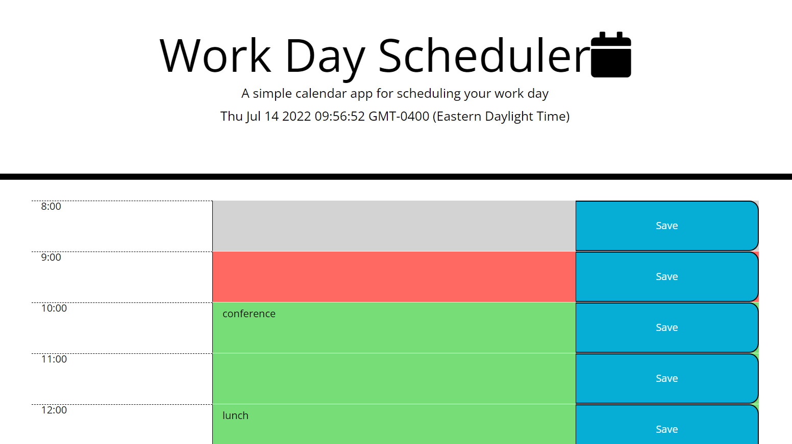

# Scheduler

📖Weekly Challenge 5
Implemented the following user story:

## User Story

AS AN employee with a busy schedule
I WANT to add important events to a daily planner
SO THAT I can manage my time effectively

## Acceptance Criteria
GIVEN I am using a daily planner to create a schedule
WHEN I open the planner
THEN the current day is displayed at the top of the calendar
WHEN I scroll down
THEN I am presented with time blocks for standard business hours
WHEN I view the time blocks for that day
THEN each time block is color-coded to indicate whether it is in the past, present, or future
WHEN I click into a time block
THEN I can enter an event
WHEN I click the save button for that time block
THEN the text for that event is saved in local storage
WHEN I refresh the page
THEN the saved events persist

## About the site

The day is displayed at the top of the planner. You have time blocks for hours 8 - 16 (8:00 - 4:00). The time blocks are color coded based on the current hour, previous hours, and future hours. You can input an event and hit the save button. Upon refresh your events will remain because they are saved to local storage.

## Assets

The URL is: https://rikrox.github.io/Scheduler/

Repository located at: https://github.com/RikRox/Scheduler

